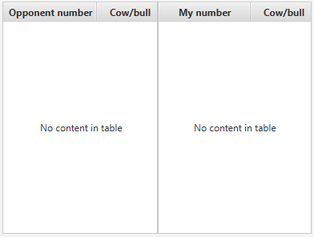
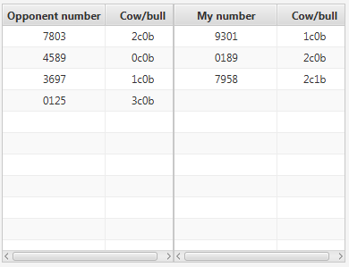

# Требования к проекту
---
## Содержание
1. [Введение](#1) 
  1.1. [Назначение](#1.1)  
2. [Бизнес требования](#0)  
3. [Требования пользователя](#2)  
  3.1. [Программные интерфейсы](#2.1)  
  3.2. [Интерфейс пользователя](#2.2)  
  3.3. [Характеристики пользователей](#2.3)  
4. [Системные требования](#3)  
  4.1 [Функциональные требования](#3.1)  
  4.2 [Нефункциональные требования](#3.2)  
    4.2.1 [Атрибуты качества](#3.2.1)  
    4.2.2 [Ограничения](#3.2.2)  
5. [Описание игры](#4)  
  5.1 [Цель игры](#4.1)  
  5.2 [Правила игры](#4.2)  
6. [Аналоги](#5)  

## 1. Введение 
### 1.1. Назначение 
В этом документе описаны функциональные и нефункциональные требования к сетевой игре «Bulls and Cows».

## 2. Бизнес требования 
Быки и коровы — логическая игра, в ходе которой за несколько попыток один из игроков должен определить, какое число задумал другой игрок.
Данное приложение «Bulls and Cows» - сетевая игра для двоих, которая развивает логику мышления, счёт, память. Для неё достаточно иметь друга, свободное время и немного везения.

## 3. Требования пользователя 
### 3.1. Программные интерфейсы 
Присутствует интерфейс для связи графической оболочки с логической частью приложения.

### 3.2. Интерфейс пользователя 

Первое окно отображает состояние игры. В колонке «Opponent number» будут отображаться попытки игрока отгадать число противника, а в колонке «My number» - попытки оппонента угадать загаданное игроком число.
  

  

Следующее окно появляется в начале раунда. Каждый игрок вводит загаданное число. 
  

В течении игры будет появляться окно, предлагающее ввести предполагаемое игроком число противника.

По окончанию раунда игрокам будет предложен выбор:  
  

### 3.3. Характеристики пользователей 
Целевой аудиторией являются люди любого возраста, кто хочет интересно провести свободное время и немного напрячь интеллект.

## 4. Системные требования 
### 4.1. Функциональные требования 
Пользователю предоставлены следующие возможности:
   1. Ввод числа.
   2. Мониторинг введенных своих значений и значений противника(за исключение загаданных чисел).
   3. Предоставление выбора в конце раунда: повторить игру или закончить.
   4. Окончание игры в середине раунда.

### 4.2. Нефункциональные требования 
#### 4.2.1 Атрибуты качества 
- Кроссплатформенность.
- Мониторинг.

#### 4.2.2 Ограничения 
Запуск приложения производится под любой ОС на которой установлен JVM. Также одним из условий подключения игроков по сети является запущенный сервер.

## 5. Описание игры 
  #### 5.1 Цель игры 
Угадать загаданное число соперника. 

  #### 5.2 Правила игры 
Каждый из игроков задумывает и вводит тайное 4-значное число с неповторяющимися цифрами. Игроки по очереди пытаются угадать число соперника, вводя комбинации, состоящие из 4 неповторяющихся цифр. По окончании хода игроку выводится количество содержащих в загаданном числе «коров» и «быков»: сколько цифр угадано без совпадения с их позициями в тайном числе и сколько угадано вплоть до позиции в тайном числе соответственно. Например: 
Задумано тайное число «0751». 
Попытка: «1795». 
Результат: две «коровы» (две цифры: «1» и «5» — угаданы на неверных позициях) и один «бык» (одна цифра «7» угадана вплоть до позиции). 
Побеждает тот, кто угадает число первым.
  
## 6. Аналоги 
Оригиналом разрабатываемой игры «Bulls and Cows» является старая «добрая» игра «Быки-коровы» с бумагой и ручкой. Сначала игра была задумана для двух игроков, но с появлением компьютерных версий стал популярен вариант, когда игрок отгадывает число, задуманное программой, то есть играет в одиночку. В электронных версиях игру на расстоянии против противника обеспечивает функция многопользовательской игры.
